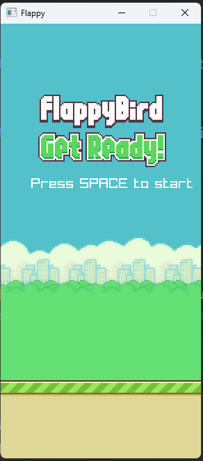
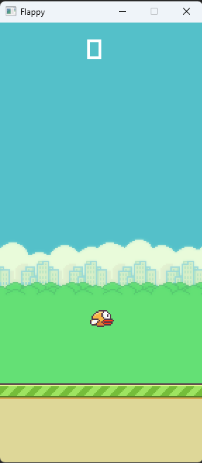

# Flappy
Flappy bird clone in C# using Raylib.

## How to play?
- Press `Space` to jump / start the game / restart the game.

## Dependencies
- [Raylib](https://www.raylib.com/)
- [Raylib-cs](https://nuget.org/packages/Raylib-cs/)

## Assets
- [Flappy bird assets](https://www.spriters-resource.com/mobile/flappybird/sheet/59894/)

## Screenshots

## License
MIT